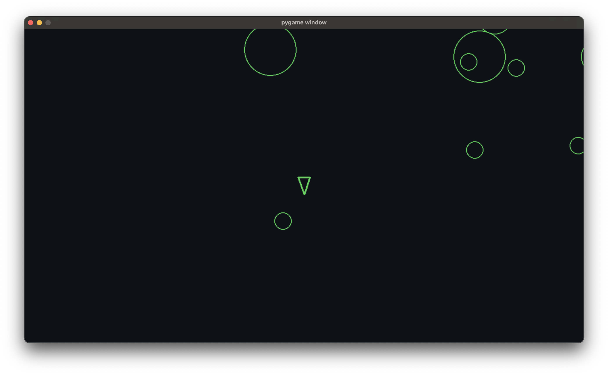
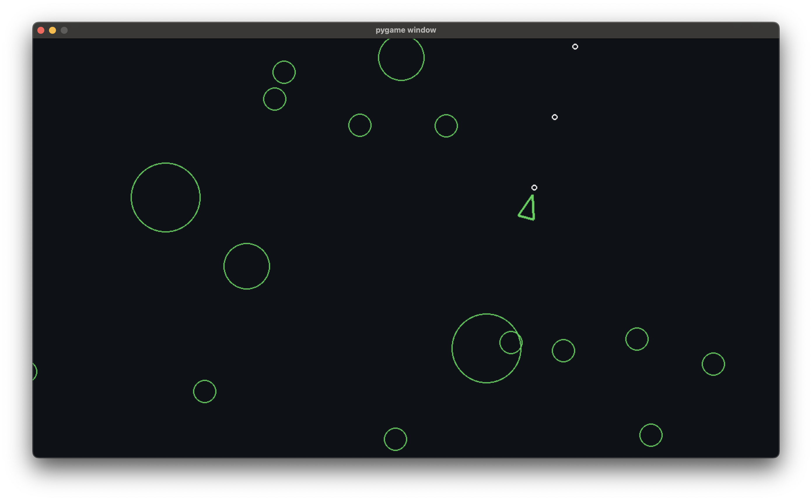
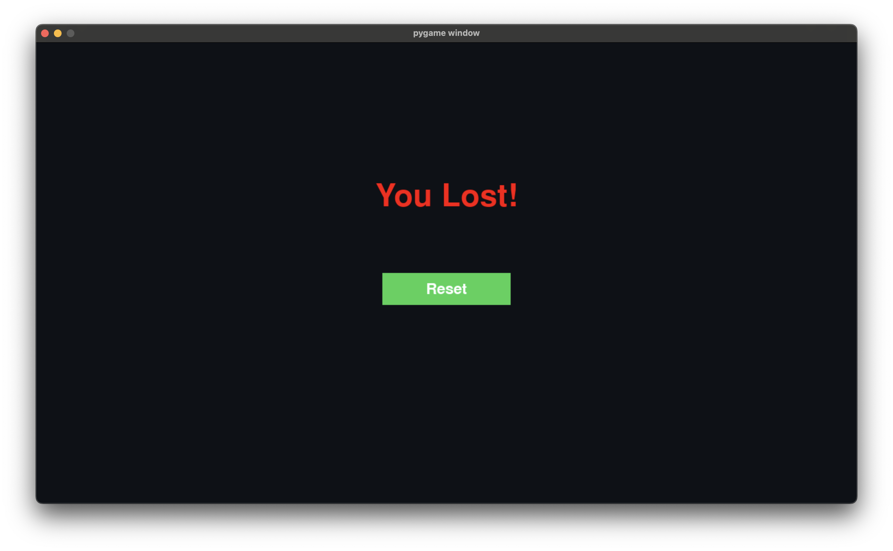
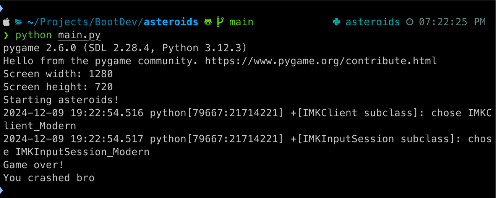
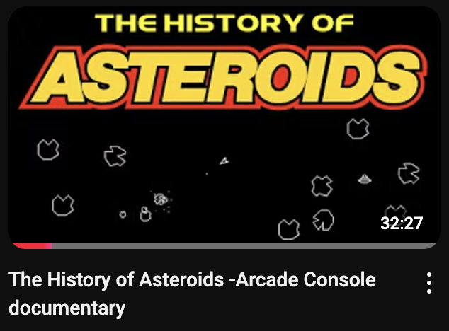

# Asteroids

A fun little [pygame](https://www.pygame.org/news) program to help improve my python skills. Why not Asteroids?!

### Here's a break down of the project.

-   &nbsp;main.py Initializes pygame&nbsp;
-   &nbsp;Prints game configurations (screen width/height) and a message&nbsp;
-   &nbsp;Sets up a clock to manage game speed&nbsp;
-   &nbsp;Creates the game window using screen dimensions&nbsp;
-   &nbsp;Creates different groups to manage sprites (objects) in the game:&nbsp;
    -   &nbsp;updatable: contains objects that need to be updated each frame&nbsp;
    -   &nbsp;drawable: contains objects that need to be drawn on the screen&nbsp;
    -   &nbsp;asteroids: contains asteroid objects&nbsp;
    -   &nbsp;shots: contains player-fired shots&nbsp;
-   &nbsp;Many more... Go play the game&nbsp;

## Prerequisite

1.  [pygame](https://www.pygame.org/news):

    -   `python3 -m pip install -U pygame==2.6.0`

2.  [venv virtual environments](https://docs.python.org/3/library/venv.html):

    -   `python -m venv C:\path\to\new\virtual\environment`

## Running the Project

```
git clone https://github.com/code-qtzl/asteroids.git
cd asteroids
source venv/bin/activate
python main.py
```

## Gameplay Screenshots









## [The History of Asteroids](https://youtu.be/JiGjU-NnkfE?si=2JI7ip0Z0hGDEmD7)

Not my video, but found it to be a fun watch on the history of Asteroids.


