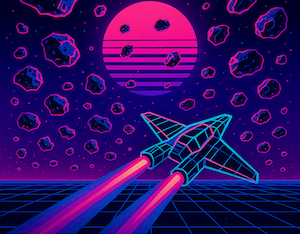
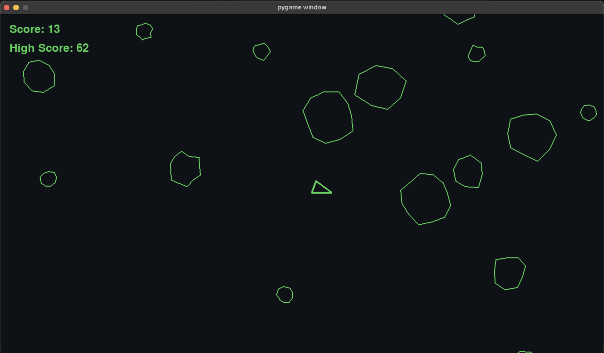
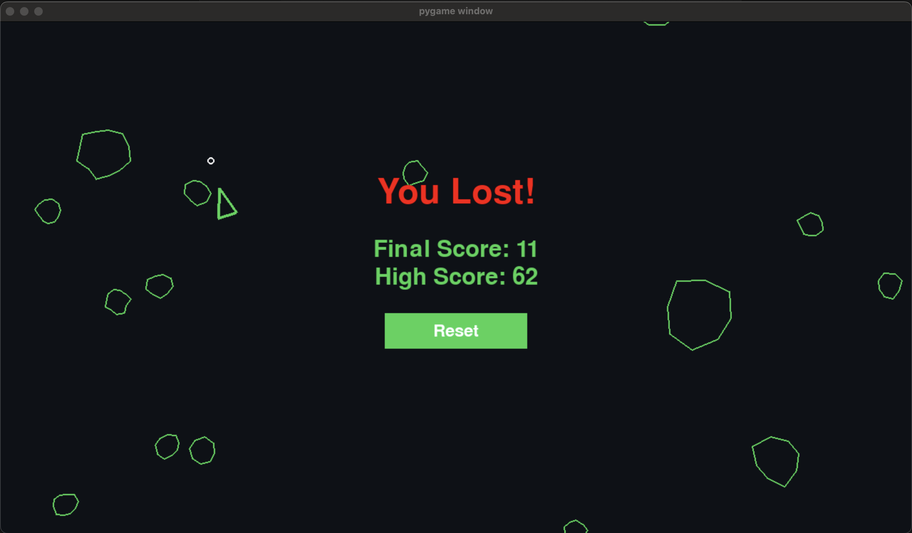

# Asteroids

<div align="left">
  
</div>

A fun little [pygame](https://www.pygame.org/news) program to help improve my python skills. Why not Asteroids?!

## Features

### Pygame Objects

-   **Clock** (`pygame.time.Clock`): Controls frame rate and game timing
-   **Sprite Groups** (`pygame.sprite.Group`): Manages game objects
    -   Updatable sprites
    -   Drawable sprites
    -   Asteroid sprites
    -   Shot sprites
-   **List:** List for array operations

### Game Architecture

-   **Class Inheritance**: Base `CircleShape` class extended by:
    -   `Player`
    -   `Shot`
    -   `Asteroid`
    -   `Alien`
-   **Event System**: Handles player input and game events
-   **Collision Detection**: Manages object interactions
-   **Score System**:
    -   [AWS DynamoDB](https://docs.aws.amazon.com/dynamodb/)
    -   Local display of current and high scores during gameplay
    -   Scores stored by unique hostname/username

## Game Controls

| Key             | Action          |
| --------------- | --------------- |
| ↑ (Up Arrow)    | Thrust Forward  |
| ↓ (Down Arrow)  | Thrust Backward |
| ← (Left Arrow)  | Rotate Left     |
| → (Right Arrow) | Rotate Right    |
| Space           | Fire            |
| P               | Pause Game      |

## Prerequisite

1.  [pygame](https://www.pygame.org/news):

    -   `python3 -m pip install -U pygame==2.6.0`

2.  [AWS SDK (boto3)](https://boto3.amazonaws.com/v1/documentation/api/latest/index.html):

    -   Included in requirements.txt
    -   AWS credentials required for high score feature

3.  [venv virtual environments](https://docs.python.org/3/library/venv.html):

    -   `python -m venv C:\path\to\new\virtual\environment`

## Running the Project

```
git clone https://github.com/code-qtzl/asteroids.git
cd asteroids
source venv/bin/activate
python main.py
```

## ✨ Gameplay

<div align="center">
 
<p>Gameplay</p>
<br/>
 
<p>Highscore</p>
</div>

## [The History of Asteroids](https://youtu.be/JiGjU-NnkfE?si=2JI7ip0Z0hGDEmD7)

Not my video, but found it to be a fun watch on the history of Asteroids.


## Contact

Feel free to reach out to collab or if you have and questions!
